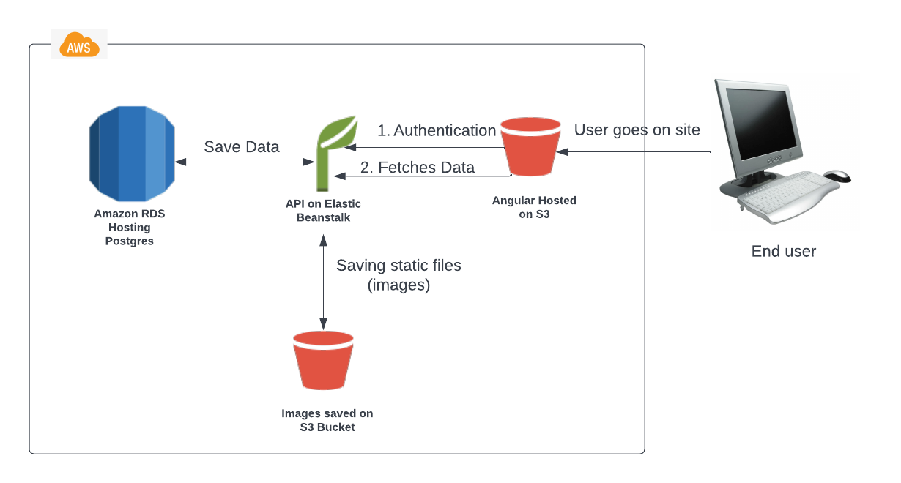

## Infrastructure
In the below diagram, the user interact with the `Angular Frontend` hosted on S3 Bucket.
which communicates with the API hosted on EB in order to firstly authenticate the user. Then, once the user is authenticated, the user can post/retrieve data.

The environment in turn communicates with an RDS postgres instance where User data & feed items are stored.

The API also generates signed urls of feed files for another S3 bucket which are used to upload & retrieve feed files.

