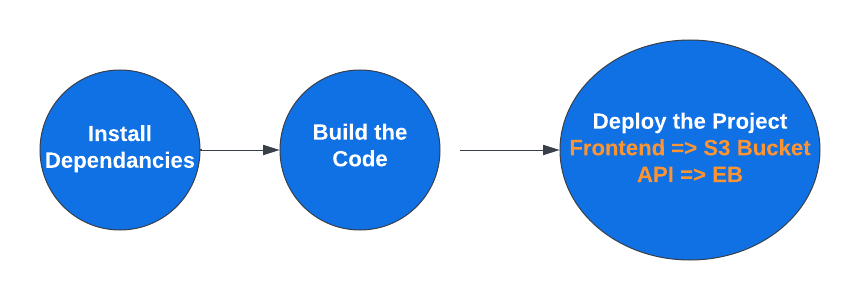

## Pipeline
CircleCi is used as the CI/CD provider. The pipeline jobs & workflow are defined in `.circleci/config.yml`.

The pipelne runs automatically on every push to the `master` branch. It uses the root `package.json` file for running common taskes like installing dependancies and deployment.

The pipeline steps are as follow:
1) Installing Dependancies.
2) Buid Project, if any erros, exit.
3) Deploy Project.

## Deployment Step
1) We install AWS CLI to be able to use it to deploy the frontend to S3 Bucket.
2) We Install Elastic Beanstalk CLI to be able to deploy API to the EB.
3) Run the deployment Scripts in package.json.